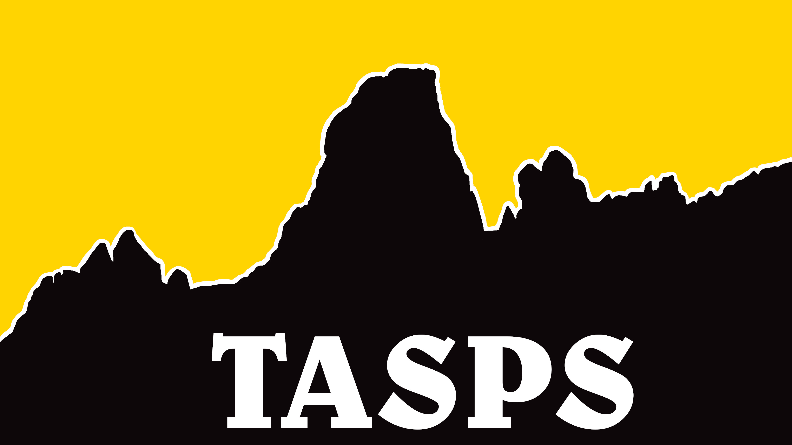

<html>

<body>

<h3>Noah Etherington IT Project</h3> 

<h4 style="text-align:center;">“TASPS”</h4>

TASPS is a name for an idea I have had for many years. The idea of going out on an unmarked or trackless bushwalk may seem daunting for a lot of people and I do not blame them. But what if they could easily see their surroundings on their smart device and using an application, plan a route regardless of if there is a track or not. Using data such as satellite imaging and topography mapping TASGPS would combine the 2 and use AI to plan the most effective yet safe route to the walker and flora.

In the modern world, it is estimated that around 6-7 billion smartphones exist and the technology on these devices is only getting better with time. One of the features that have found its way onto mobile devices is accurate GPS (Global Positioning Systems) without any data or cellular signal. This feature in collection with cameras that give DSLR cameras a run for their money and evolving battery technology makes mobile phones a great device to use in the outdoors.

My home state of Tasmania has some of the most remote, beautiful yet dangerous places in all of Australia and even the world. Some of these areas are so remote that it is claimed Sir Edmund Hillary (Alleged first summiteer of Everest) labeled Tasmania's Federation Peak as Australia's only real mountain (ABC 2017). But the problem is that in areas like the southwest, all its terrain is not tracked or marked. This requires a lot of preplanning when going on hikes where you are lucky to see another human for days or even weeks. The number of times I have planned my route using a topographic map to be met with a large amount of scrub or a rock scramble that took an hour longer than expected is more than expected. I believe in the future I could develop a solution for this in hopes of getting more people outdoors to see these beautiful sights.

TASPS would work similarly to most GPS software at the current time. It would look like one, feel like one but would have a feature that I am yet to see on any GPS platform to date. The ability to mark accurate and safe off-track routing. With current applications, if you select a start point and finish point on an area with no track the application will simply draw a straight line from point A to B. This will almost 100% be an unpleasant and annoying walk with many diversions and corrections. I plan to achieve this by using GPS map topography, Satellite imagining data, and some form of AI.

Topography mapping is a practice in which terrain is mapped using incrementing lines to represent incline. For example, a topographic map with a gapping measurement of 5 meters will show lines for every 5 meters of elevation gained on a map. So, if a cliff face is present on a map, you will see a very grouped portion of lines representing that rapid incline where if a flat plane is present, you may not see a line for 100 meters depending on how flat the area is. This data can be used to plan a walk that will be the easiest on your knees and navigate you around any dangerous environmental changes. A topographic map can be sourced from many physical and online merchants, even some governments supply them for free with open-source capabilities. But topographic maps' main issue is the visual data that most topographic maps lack. This is where I believe satellite imagery could provide a helping hand.

Satellite imaging is one of our best views on the world as we know it. In 2019 google estimated that google maps cover at least 98% of our planet (Cnet 2019). This gives us a detailed view of most of the world's flora and geology. Google maps in its current state allow companies to embed their data in their website if google is credited. Luckily, Google also supplies APIs (Application Programming Interfaces) to allow embedding of custom maps for your website or application (Google Earth Web and App Guidelines 2019).

I believe that using these 2 forms of data, a layer map system could be achieved giving the user a topographic view to see incline and satellite data to see flora and geology. So, with using this system the user now has a detailed view of their surroundings, but what can they do with this? TASPS would have a route planner that is completely AI-driven. It would first use the data from the topographic map to have a rough estimate on what route to take, but would then compare that with satellite imagery to see if the original route is viable. If not, it would adjust the route to suit the satellite data until a final route is determined and whether this is achieved in 1 attempt or 10, I believe the AI could get this done in a matter of seconds.

So, with the app ideology in mind, the cons must be assessed. Some negatives that are apparent would-be people taking on larger adventures outside of their ability, in worst cases requiring rescue. But also having people hike through remote locations exposes some of the delicate and untouched flora. For both these issues, I think the same solution could be applied, Education. TGPS would host a vast amount of information on locations, flora, and fauna all sourced from local government websites. Education is the key to a lot of problems and I believe it to be the solution to these examples.

But to achieve this idea, I am going to have to gain a mass knowledge of software development and AI (Artificial Intelligence) creation which I hope to achieve at the end of my learning. This would include being fluent in many languages but focusing on Python for my AI and machine learning. Python in its current build is the go-to for beginner AI programmers with many online tutorials and classes to learn from. In conjunction with fluidity in programming languages, I would have to become familiar with application development tools to pair my code and data with.

Whilst people like myself admire the challenge of bush bashing and discovery some people may want a more laid out and accessible experience. This is where I believe TASPS could be a viable app in the future for those wanting a more remote adventure experience without needing years of mapping experience. It would give experienced walkers more direct routes whilst also supplying peace of mind for less experienced walkers.

 

 </body>
</html>

 
